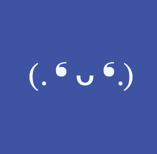

<!-- PROJECT LOGO -->

  

  <h3 align="center">Textmagotchi</h3>

  

    A Tamagotchi-like game for your browser!
     
    <a href="https://github.com/Rancor38/textmagotchi"><strong>Explore the docs »</strong></a>
     
     
    <a href="https://rancor38.github.io/textmagotchi/">View Live Game</a>
    ·
    <a href="https://github.com/Rancor38/textmagotchi/issues">Report Bug</a>
    ·
    <a href="https://github.com/Rancor38/textmagotchi/issues">Request Feature</a>
  

<!-- ABOUT THE PROJECT -->
## About The Project

[![Texmagotchi Screen Shot][game-image-1]](https://github.com/Rancor38/textmagotchi)

Have you found yourself looking for a simple online browser game similar to Tomagotchi? I have. I scoured the internet looking for an example to share for a software engineering course I was helping to teach -- and since I couldn't find an example, I decided to build one myself.

[![Texmagotchi Screen Shot][model]](https://github.com/Rancor38/textmagotchi)

Here's the game:
* You start off by going to the site in your favorite browser, and clicking start
* You can lower the scores for 'bored', 'hungry', or 'sleepy' by pressing the buttons to 'play games', 'feed', or 'send to bed'.
* If you hold out for one minute you will have won the game!

[![Texmagotchi Screen Shot][game-image-2]](https://github.com/Rancor38/textmagotchi)

Of course, this is a simple game that was made in a day so it doesn't have many features but I thought that it was fun, and suited my purposes for the class. Thanks to all the people have played to test it out, and to those who suggested features for the future!

(<a href="#readme-top">back to top</a>)

<!-- MARKDOWN LINKS & IMAGES -->
[game-image-1]: ./public/game-image-1.png
[game-image-2]: ./public/game-image-2.png
[model]: ./public/model.png